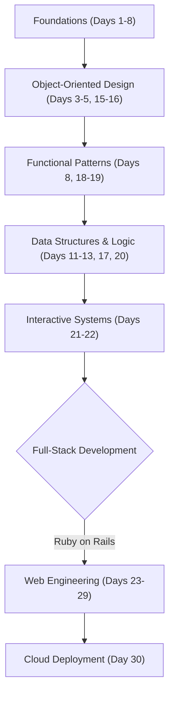

# Technical Specification: Ruby Programming Challenge

## Architectural Overview

**Ruby Programming Challenge** is a structured, modular repository architecture designed to facilitate a disciplined 30-day curriculum into Ruby programming and Ruby on Rails Development. The project serves as an extensive study into object-oriented design, functional paradigms, and rapid application engineering, bridging the gap from foundational syntax to cloud-deployed production environments.

### Learning Logic Flow

---

## Technical Implementations

### 1. Core Ruby Engine
-   **Runtime Environment**: Optimized for **Ruby 3.x**, utilizing the **Rubygems** ecosystem and standard library for robust computational and engineering logic.
-   **Modular Design**: Implements a highly organized source code architecture where each daily module focused on specific linguistic features, design patterns, or framework components.

### 2. Specialized Frameworks & Libraries
-   **Full-Stack Development**: Leverages **Ruby on Rails** for high-velocity application development, implementing MVC architecture, RESTful routing, and database migrations.
-   **Database Management**: Utilizes **Active Record** with **SQLite3** for development and production-ready data persistence.
-   **Authentication & Styling**: Integrates **Devise** for secure identity management and **Bootstrap** for responsive UI/UX engineering.

### 3. Engineering Frameworks
-   **Software Design Patterns**: Implements core OOP principles including encapsulation (Getters/Setters), inheritance, and module-based composition for scalable software architecture.
-   **Interactive Systems**: Features algorithmic implementations of classic games (TicTacToe, Hangman) and linguistic processing utilities.

---

## Technical Prerequisites

-   **Runtime**: Ruby 3.0 or higher ([Ruby-lang.org](https://www.ruby-lang.org/)).
-   **Framework**: Ruby on Rails 7.x ([Rubyonrails.org](https://rubyonrails.org/)).
-   **Development**: RubyMine, VS Code (with Ruby LSP), or any professional IDE.
-   **Database**: SQLite3 for local persistence and PostgreSQL for production environments.

---

*Technical Specification | Ruby Language | Version 1.0*
